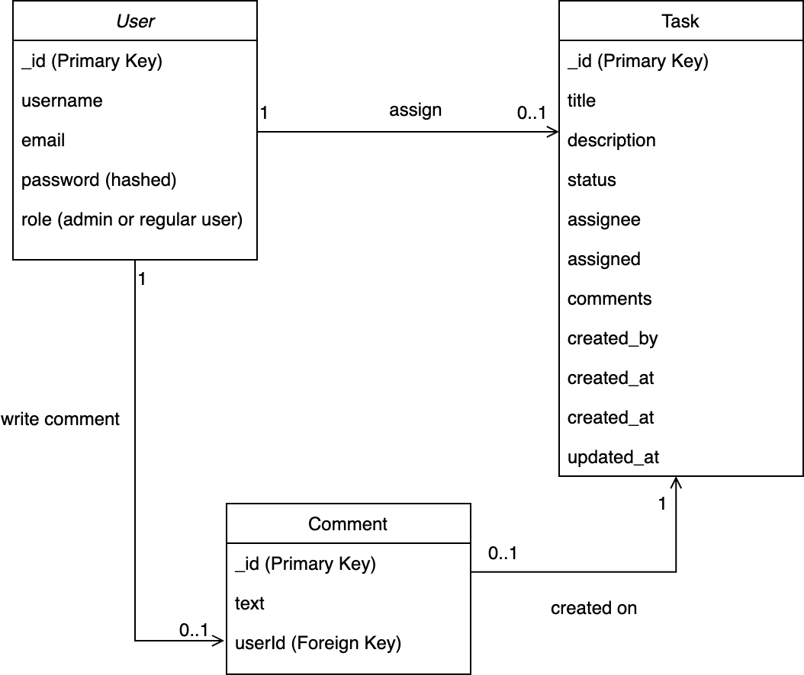
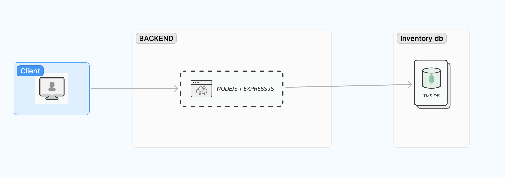

# Task management system

## Database diagram

- `Users` have a `one-to-many` relationship with `Tasks` and `Comments`, meaning that each user can get multiple tasks and write multiple comments.
- `Comment` have many-to-one relationships with `Task` a, indication that a one task can have multiple comments.

## System Design

## Technical design document (TDD)

[TDD figma link](https://www.figma.com/file/MvWb9OktliDJSTjT4FXd2Q/Task-management-system?type=whiteboard&node-id=0-1&t=bOVIEnO7Mtg0r8qJ-0)
